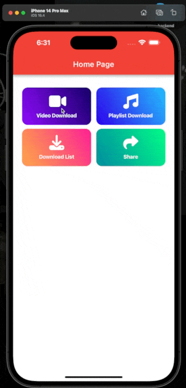

### 🚀 Youtube Video Downloader Flutter

Youtube Video Downloader is an app that gives you the chance to download any YouTube video, quickly, easily and from the comfort of your smartphone.

Using Youtube Video Downloader is super easy because it includes basically all the same features that the official YouTube app does. So, browse the content just like you would in YouTube, find the video you want to save, and click on the arrow button to open the download window. Once you’ve specified the quality of the file, you can start the downloading process.

<h4>Features</h4>
<ul>
    <li>Beautiful user interface</li>
    <li>Lightweight and fast</li>
    <li>Display general info about videos</li>
    <li>No Login Required</li>
    <li>Keep your liked videos and comments</li>
    <li>Playlists support</li>
    <li>Download videos, audios and thumbnails</li>
    <li>Ads free forever</li>
    <li>Free libre and open source</li>
    <li> Auto detect videos and easily download</li>
    <li>Download videos in the background</li>
</ul>

<h4>Supported platforms</h4>

<ul>
    <li>Android</li>
    <li>iOS</li>
</ul>

For Android Static Path is Used and for ios Path Provider is Used

<h4>Supported services</h4>
<ul>
    <li>Youtube</li>
</ul>

### Pictures

### Build from source

- Clone this repo and then for building

### License

Youtube Video Downloader is a Free Software: Do whatever you want with this privately for your own use and do public the source code with same license when you release it for public / when you use it commercially.

  
  
Show Some Love, &#11088; the Repositories! 

